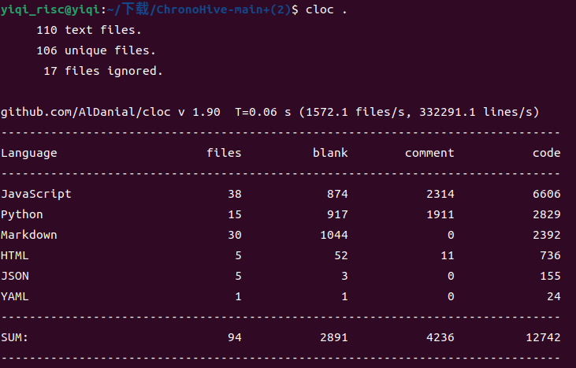

# ChronoHive
时光蜂巢（ChronoHive）是中山大学本科生软件工程大作业的成果，旨在利用现有的大语言模型技术，提供高效的日程规划与优化服务。

## 小组成员
| 姓名         | 学号        | 
| :----:       |    :----:  |  
| 赵施琦   | 23336324       | 
|    郭靖宇          |    23320048        | 
|       严浩文       |     23354177       |   
|       张文坚       |       23336309     |   
|      杨鑫        |      23336284      |   

## 导航
[文档](./docs)——存放了所有要求提交的文档、UML图以及UML图代码

[代码](./src)——存放了所有代码

[项目演示视频](./video)

[demo](./video)

## News
3.3正式建队  

3.29建立仓库 

4.12实现核心功能

6.15实现所有基础功能

7.6成功部署到云服务器上


## 框架


## 工作量展示


如图所示，最终我们的主分支下共有12K+LOC


## ChronoHive 后端简介

​	ChronoHive后端采用`Flask`框架，结合模块化与容器化一键部署架构，旨在为智能日程管理平台提供弹性、易扩展的服务支撑。系统各模块以高内聚低耦合的方式协作，实现了智能日程规划、多终端友好分发与高效数据管理。


### Architecture
```
project-root/
│
├── docker/
│   ├── client/
│       ├── Dockerfile
│   ├── server/
│       ├── Dockerfile # 后端dockerfile
│       ├── requirements.txt # 配合dockerfile进行镜像构建
├── server/
│   ├── templates/
│       ├── index.html # 软件下载页
│   ├── static/
│       ├── app-debug.apk # apk包
│   ├── agents.py # 模型提示词
│   ├── app.py # 后端主程序
│   ├── db.py # 数据库连接
│   ├── utils.py # 工具函数
│   ├── workflow.py # agent工作流
│   ├── requirements.txt # 后端依赖
├── docker-compose.yml # docker-compose配置文件
└── README.md

```


- **多层模块化架构**  
  系统将核心调度、多Agent智能任务工作流、数据存储管理、客户端下载分发等功能解耦分层。各模块通过标准化接口交互，便于功能升级和横向扩展。

- **数据库设计**  
  后端集成高效关系型数据库（如 MySQL），用于持久化用户信息、智能日程方案和操作历史。所有数据操作均通过后端 API 进行，支撑智能规划、回溯、分析等核心功能。  
  为便于开发部署，数据库服务同样以 Docker 方式集成，数据库参数可灵活配置，适应不同业务场景。

- **微服务与容器化部署**  
  利用`Docker Compose`实现后端（Flask应用）、数据库、其他服务的分布式组装，部署快速、隔离可靠。系统即开即用，可平滑迁移至多种云环境与本地环境。

- **前后端分离与客户端下载**  
  网页端专注于客户端下载和分发，提供直观的APP下载入口；后端负责 APK 静态资源路由和权限控制，有效提高客户端下载效率和安全性。前后端解耦，易于迭代更新。


#### 创新特色

1. **智能多智能体工作流引擎**  
   借助多Agent架构，实现用户意图理解、任务自动拆解、周期自动排程等智能化处理，满足复杂日程管理需求。

2. **健壮数据处理与校验机制**  
   后端内建 JSON 自动纠错与结构化提取算法，显著提升数据交互的鲁棒性。

3. **统一 API 接口与灵活扩展能力**  
   提供标准化 API，支持静态资源（如 APK）以及业务数据的安全传递，方便 Web、App、第三方系统无缝集成。

## ChronoHive 前端简介

​	ChronoHive 前端由五个主要界面组成，分别为：**登录界面**、**月界面**、**周界面**、**AI 智能助手界面**和**设置界面**。整体架构采用模块化设计，强调**高内聚、低耦合**的原则，使得各模块既独立运行又能高效协同，确保系统在功能拓展、性能优化及后期维护中的可持续性。通过与后端接口高效通信，实现智能日程管理与规划等多种功能。

### Architecture

前端的主要代码框架如下：

```
frontend
├─data                 # 本地静态数据与资源
├─src_accessory        # 辅助组件及通用资源
│  └─img               # 公共图片资源
├─src_loginUI          # 登录界面模块
├─src_message          # 消息通知与提示模块
├─src_monthUI          # 月视图界面模块
├─src_settingsUI       # 设置界面模块
│  └─img               # 设置界面独立图像资源
└─src_weekUI           # 周视图界面模块
```


#### 创新特色

##### 1.月界面到周界面之间的灵活切换

​	在月界面的日程模式下，点击日期块可以跳转到周界面中对应的那一周，方便用户在不同日期下查询对应周的安排。

##### 2.月界面双模式切换

​	月界面中有两种模式，日程模式和截止模式，通过一个开关控制。日程模式下，点击日期块可以跳转到周界面中对应的那一周，目前传递了被点击日期块的日期。截止模式下，点击日期块可以显示当天的截止任务。

​	不同模式下，日期块内容有所不同：日程模式下，每个日期块显示一个日程（如有）对应颜色的圆点（目前实现的是每天显示一个或者零个日程）；截止模式下，每个日期块显示当天DDL（如有）的数量，显示"DDL*N"（N为当天DDL数量）。

##### 3.当前月份自动居中渲染

​	月界面通过计算当前月偏移量、渲染时进行滚动，使得渲染完成时当前月位于屏幕中央

##### 4.多层级颜色标识系统

​	月界面当前月和其他月的月标题为不同字体颜色标识；在每个月的日期块中，非该月日、该月周末、当前日、该月工作日为不同背景和字体颜色标识。

​	同样，在周界面中，当日也会用不同的颜色来标记。
