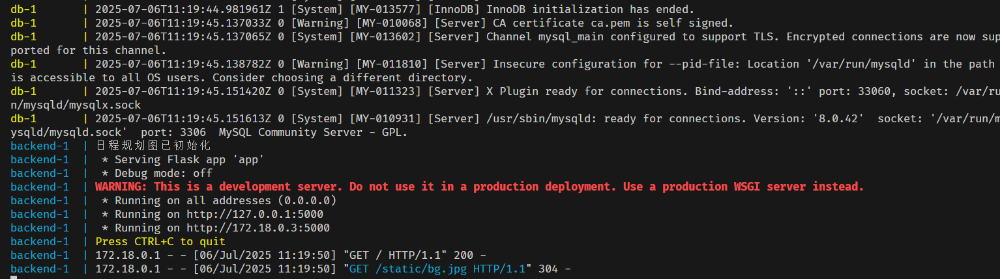

# ChronoHive
时光蜂巢（ChronoHive）是中山大学本科生软件工程大作业的成果，旨在利用现有的大语言模型技术，提供高效的日程规划与优化服务。

## 小组成员
| 姓名         | 学号        | 
| :----:       |    :----:  |  
| 赵施琦   | 23336324       | 
|    郭靖宇          |    23320048        | 
|       严浩文       |     23354177       |   
|       张文坚       |       23336309     |   
|      杨鑫        |      23336284      |   

## 导航
[文档](./docs)——包含了我们所有的文档、UML图和UML代码

[代码](./src)——包含了我们所有的前后端代码

[项目演示视频](./video)

## News
3.3正式建队  

3.29建立仓库 

4.12实现核心功能

6.15实现所有基础功能

7.6成功部署到云服务器上


## 框架


## ChronoHive 后端简介

ChronoHive后端采用`Flask`框架，结合模块化与容器化一键部署架构，旨在为智能日程管理平台提供弹性、易扩展的服务支撑。系统各模块以高内聚低耦合的方式协作，实现了智能日程规划、多终端友好分发与高效数据管理。



### Architecture
```
project-root/
│
├── docker/
│   ├── client/
│       ├── Dockerfile
│   ├── server/
│       ├── Dockerfile # 后端dockerfile
│       ├── requirements.txt # 配合dockerfile进行镜像构建
├── server/
│   ├── templates/
│       ├── index.html # 软件下载页
│   ├── static/
│       ├── app-debug.apk # apk包
│   ├── agents.py # 模型提示词
│   ├── app.py # 后端主程序
│   ├── db.py # 数据库连接
│   ├── utils.py # 工具函数
│   ├── workflow.py # agent工作流
│   ├── requirements.txt # 后端依赖
├── docker-compose.yml # docker-compose配置文件
└── README.md

```


- **多层模块化架构**  
  系统将核心调度、多Agent智能任务工作流、数据存储管理、客户端下载分发等功能解耦分层。各模块通过标准化接口交互，便于功能升级和横向扩展。

- **数据库设计**  
  后端集成高效关系型数据库（如 MySQL），用于持久化用户信息、智能日程方案和操作历史。所有数据操作均通过后端 API 进行，支撑智能规划、回溯、分析等核心功能。  
  为便于开发部署，数据库服务同样以 Docker 方式集成，数据库参数可灵活配置，适应不同业务场景。

- **微服务与容器化部署**  
  利用`Docker Compose`实现后端（Flask应用）、数据库、其他服务的分布式组装，部署快速、隔离可靠。系统即开即用，可平滑迁移至多种云环境与本地环境。

- **前后端分离与客户端下载**  
  网页端专注于客户端下载和分发，提供直观的APP下载入口；后端负责 APK 静态资源路由和权限控制，有效提高客户端下载效率和安全性。前后端解耦，易于迭代更新。


#### 创新特色

1. **智能多智能体工作流引擎**  
   借助多Agent架构，实现用户意图理解、任务自动拆解、周期自动排程等智能化处理，满足复杂日程管理需求。

2. **健壮数据处理与校验机制**  
   后端内建 JSON 自动纠错与结构化提取算法，显著提升数据交互的鲁棒性。

3. **统一 API 接口与灵活扩展能力**  
   提供标准化 API，支持静态资源（如 APK）以及业务数据的安全传递，方便 Web、App、第三方系统无缝集成。

## ChronoHive 前端简介
