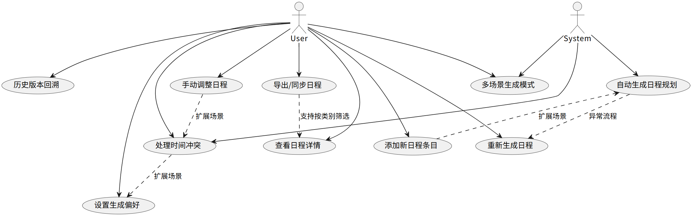
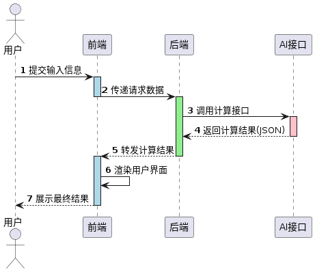
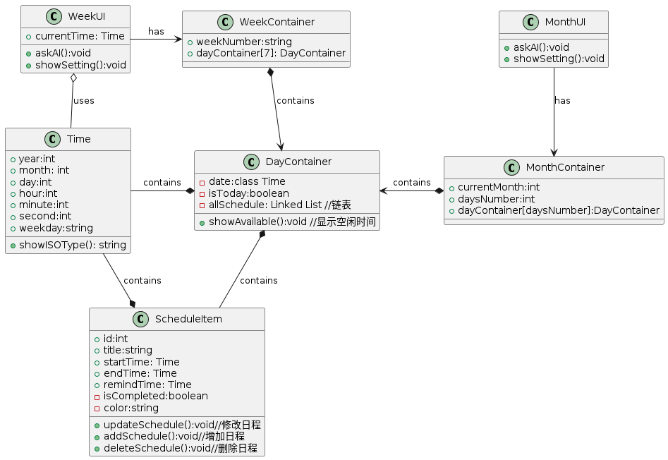
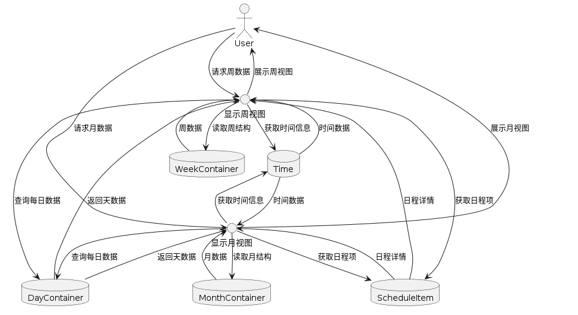

# 架构设计文档

编写：赵施琦  日期：2025-05-24

审核：赵施琦   日期：2025-05-24

发布版次：1.0 日期：2025-05-24

## 变更记录
| 日期         | 版本        | 变更说明    | 作者        |
| :----:       |    :----:  |   :----:   |    :----:   |
| 2025-05-24   | 1.0        | 初始版本    |  赵施琦     |
| 2025-06-12   | 1.1        | 技术栈添加前端框架 |  赵施琦  |

## 目录
- [引言](#1-引言)  
- [系统概述](#2-系统概述)  
- [架构设计](#3-架构设计)  
- [部署架构](#4-部署架构)  
- [监控与运维](#5-监控与运维)
- [风险管理](#6-风险管理) 
- [附录](#7-附录)

## 1. 引言
### 1.1 编写目的
本架构设计文档的目的是为了详细阐述智能日程规划软件的系统架构设计，确保开发团队、维护人员以及其他相关方能够准确理解系统的设计原理、技术选型、模块划分及其交互方式。通过此文档，期望达到以下目标：

1. **明确系统架构**：为开发人员提供清晰、结构化的系统架构视图，帮助开发团队理解系统模块之间的关系和协作流程，以便高效、稳定地开发和维护系统。

2. **提高开发效率**：为项目团队提供统一的架构规范，确保在开发过程中各个模块的设计符合整体架构规划，从而避免低效或不必要的重复工作。

3. **支持后期扩展与维护**：确保系统具备良好的扩展性和可维护性，以应对未来可能的功能扩展、性能优化及技术更新。

4. **便于沟通与决策**：为管理人员、产品经理及其他相关人员提供架构设计的详细信息，帮助各方就系统设计和实现进行有效沟通，做出正确的决策。

5. **保障系统稳定性与安全性**：通过清晰的架构设计，确保系统能够在不同环境下稳定运行，并为后期的安全性措施提供支持。

本文档面向软件开发团队、架构师、项目管理人员及相关利益相关者，旨在为软件的开发、部署、优化和维护提供全面的架构指导。

### 1.2 适用范围

本架构设计文档适用于开源免费智能日程规划软件的开发与实施。该文档详细描述了系统架构的设计原则、主要功能模块、技术选型、数据流和交互方式等内容，旨在为开发团队提供清晰的架构指导，以确保系统的高效开发、稳定运行和易于维护。

**系统的主要功能模块包括**：

1. **日程管理模块**：用户可以创建、编辑和查看个人或团队的日程，支持自动提醒和智能推荐日程安排。
2. **任务管理模块**：支持任务的创建、分配、优先级设置，并提供任务进度跟踪与反馈功能。
3. **时间分析与优化模块**：基于用户的日程数据，提供时间使用情况分析，并推荐如何优化时间管理的方案。
4. **团队协作模块**：为中小团队提供日程共享与任务协作功能，支持跨平台同步，便于团队成员之间的协调。
5. **跨平台支持**：系统可在Web、Android及iOS平台上运行，支持多设备间数据同步。

**系统边界**：

- 本系统专注于日程规划、任务管理、时间分析与团队协作功能，不涉及其他领域（如财务管理、深入项目管理等）。
- 系统适用于个人用户以及小型团队，尤其是自由职业者和远程工作者，提供高效的时间管理工具。
- 系统是开源和免费的，旨在通过减少时间浪费、提升生产力来帮助用户提高工作效率。

**技术栈概述**：

- **前端**：JavaScrpit
- **前端框架**：React Native
- **后端**：Python
- **后端框架**：Flask
- **数据库**：MongoDB
- **移动端**：React Native
- **云服务与同步**：Google Cloud

本架构设计文档的目标是确保开发团队能够准确理解系统架构，遵循设计规范，高效实施，并为后续的系统维护、扩展和优化提供清晰的技术指导。

## 2. 系统概述
### 2.1 系统目标
时光蜂巢致力于深度融合前沿大语言模型技术，构建智能化的日程规划与优化服务体系。该服务以自然语言处理能力为驱动，可精准解析用户需求并生成动态化日程方案，不仅能实现基础的日程创建、提醒与冲突检测功能，更能通过 AI 算法持续学习用户行为模式，自动优化时间分配策略，为个人与中小团队打造全流程的时间管理闭环。​

在应用场景上，时光蜂巢突破传统工具的用户边界：针对学生群体，可智能规划学习周期与考试复习节奏；面向自由职业者，能基于项目节点与创意产出特性构建弹性工作流；为远程团队提供跨时区任务协同与进度可视化追踪功能。这种差异化服务设计，旨在帮助新兴职业群体打破时间管理的认知壁垒，通过系统化的生产力框架构建，将碎片化时间转化为结构化产出，从根本上降低时间管理的技术与操作门槛。​

从社会价值维度看，时光蜂巢以 “优化知识经济时代人力资源配置” 为愿景。通过推动个体工作效率的提升，不仅能助力自由职业者实现产能升级，更能为中小团队释放组织管理效能，让时间资源在创意设计、知识服务、远程协作等新型工作模式中实现更高效的流动与配置，最终推动知识经济生态下的生产力革新与工作方式进化。

### 2.2 关键设计决策
1.大语言模型集成模式决策​

采用代理服务 + 提示工程框架的双层集成模式：​

代理服务层：封装 OpenAI/GPT 等第三方 LLM 接口，统一处理 token 管理、请求重试与成本监控，避免业务代码直接依赖特定厂商 API。​

提示工程层：独立维护提示词模板库（如日程解析模板、优化建议生成模板），通过动态参数注入实现场景化交互。选择原因：该模式可降低模型供应商锁定风险，同时通过提示词版本管理实现 AI 能力的渐进式优化，例如针对自由职业者场景定制包含 “创意灵感时段” 识别的专属提示词。

2.数据安全与隐私保护决策​

采用本地预处理 + 模型脱敏双机制：​

用户输入的日程文本在前端完成敏感信息识别（如自动掩码手机号、身份证号），仅向 LLM 传递脱敏后的内容；​

大语言模型返回的优化建议经过后端规则引擎二次过滤，禁止包含用户未授权的个人数据引用。选择原因：符合 GDPR 等隐私法规要求，同时避免敏感信息进入第三方 LLM 训练池，尤其适用于处理远程团队的商业日程数据。

### 2.3 系统功能

#### 2.3.1 核心功能模块​

1.日程管理模块​

负责基础日程的添加、修改、删除及存储，支持模糊时间解析与冲突检测​
提供日历 / 时间轴 / 列表多视图展示，支持按类别 / 优先级筛选​

2.智能生成模块​
集成大模型 API，基于用户输入和偏好生成优化日程​
支持 “高效工作”“平衡休息” 等多场景模式切换​

3.偏好设置模块​
允许用户预设规则（如固定时段、任务优先级）​
将偏好参数传递至智能生成模块影响生成逻辑​

4.冲突处理模块​
实时检测日程冲突并生成解决方案（如任务顺延）​
与日程管理模块联动实现冲突可视化提示​

5.数据交互模块​
支持 ICS/PDF 格式导出及社交媒体分享​
实现历史版本存储与回溯功能​

#### 2.3.2模块交互流程​
1.用户通过日程管理模块输入任务信息，可同步在偏好设置模块预设规则​

2.智能生成模块获取任务数据和偏好参数后调用大模型 API 生成日程方案​

3.冲突处理模块检测生成结果中的时间冲突，反馈至日程管理模块进行高亮提示​

4.用户手动调整日程时，冲突处理模块实时触发冲突检测并提供解决方案​

5.最终日程可通过数据交互模块导出或同步，历史版本自动存储至该模块

## 3. 架构设计
### 3.1 总体架构

在总体架构下，用户作为交互主体向前端提交日程内容、偏好设置等任务信息，前端接收后先渲染加载状态界面，再将请求数据封装传递给后端；后端作为业务逻辑层接收数据后调用 AI 接口的计算服务，参数包含用户输入的日程文本、优先级规则等，AI 接口执行大模型推理后以 JSON 格式返回优化后的日程表等结构化计算结果；当后端将结果转发给前端后，前端解析后以日历视图、时间轴等可视化界面呈现给用户。此交互流程体现了前后端分离架构与 AI 服务集成的技术方案，通过前端 - 后端 - AI 的三层异步调用链实现人机交互与算法计算的解耦，利用 JSON 格式规范数据交换以保证跨平台兼容性，AI 接口对接 OpenAI/GPT 等大模型服务的 API 网关。

### 3.2 组件设计

下面我们将以局部到整体的顺序介绍系统的组件设计细节

#### 3.2.1 Time
`Time`类主要用于表示时间信息，并提供相关操作和方法。它将年、月、日、小时、分钟、秒和星期几等信息封装为一个时间对象，这些时间对象将在系统的多个地方使用。

**接口：**
1. **属性：**
   - `year`: 表示年份（`int`）。
   - `month`: 表示月份（`int`）。
   - `day`: 表示日期（`int`）。
   - `hour`: 表示小时（`int`）。
   - `minute`: 表示分钟（`int`）。
   - `second`: 表示秒数（`int`）。
   - `weekday`: 表示星期几（`string`）。

2. **方法：**
   - `showISOType()`: 返回一个字符串，通常是ISO标准的日期时间格式，表示该时间对象的标准时间格式。返回类型为`string`。

**责任：**
1. **时间表示**：`Time`类的主要职责是存储和表示具体的时间信息，包括年月日、时分秒以及星期几。它将这些信息封装成一个对象，方便在系统中传递和操作。
   
2. **格式化输出**：通过`showISOType()`方法，`Time`类可以将其存储的时间信息转化为标准的ISO格式字符串，方便显示或与其他系统进行交互。

**与其他组件的交互：**
1. **与`WeekUI`的交互：**
   - `WeekUI`类使用`Time`类表示当前的时间（`currentTime: Time`）。`WeekUI`通过`Time`来展示当前的时间信息，可能用于动态更新界面或进行时间相关的计算。

2. **与`DayContainer`的交互：**
   - `DayContainer`类包含一个`Time`对象（`date: Time`），用于表示一天的具体时间。`DayContainer`类也会使用`Time`来判断是否为今天（`isToday`），这在日历或日程应用中非常重要。

3. **与`ScheduleItem`的交互：**
   - `ScheduleItem`类包含多个`Time`对象，例如`startTime: Time`、`endTime: Time`和`remindTime: Time`，这些时间表示日程的开始、结束和提醒时间。`ScheduleItem`会依赖`Time`来设置和修改日程时间，确保日程与实际时间的正确性。

4. **与`MonthContainer`的交互：**
   - `MonthContainer`类中的`dayContainer[daysNumber]: DayContainer`数组每个元素都是`DayContainer`对象，而每个`DayContainer`都包含一个`Time`对象。这意味着`MonthContainer`通过`DayContainer`中的`Time`来管理和展示每一天的时间信息。

5. **与`WeekContainer`的交互：**
   - `WeekContainer`类中的`dayContainer[7]: DayContainer`数组中，每个`DayContainer`也会包含一个`Time`对象。`WeekContainer`类利用这些`Time`对象来表示一周中每一天的具体时间，并在界面上展示或操作。

`Time`类在这个系统中是一个关键的时间管理类，负责表示和处理日期、时间以及星期等信息。它为其他组件提供时间相关的数据支持，尤其是在日历、日程安排和提醒功能中起到了基础性作用。

#### 3.2.2 ScheduleItem
`ScheduleItem` 组件负责管理和表示具体的日程项

1. **功能**:
   `ScheduleItem` 代表一个日程项，它包括与日程相关的基本信息，如标题、开始时间、结束时间、提醒时间等。每个 `ScheduleItem` 还可以包含以下功能：
   - **日程信息管理**：能够修改日程的各个属性（如开始时间、结束时间等）。
   - **状态管理**：记录日程是否完成。
   - **操作管理**：提供接口来增加、修改和删除日程项。

2. **接口**:
   `ScheduleItem` 组件暴露了以下接口（方法）供其他组件调用：
   - `+updateSchedule(): void`：修改日程项的内容（如更改时间、标题等）。
   - `+addSchedule(): void`：增加新的日程项。
   - `+deleteSchedule(): void`：删除当前的日程项。
   
   这些接口使得 `ScheduleItem` 具备了对日程内容进行增、删、改的能力，能够响应外部系统（如UI）对日程管理的需求。

3. **责任**:
   `ScheduleItem` 主要负责以下任务：
   - **存储日程数据**：包括日程项的标题、开始时间、结束时间、提醒时间等。
   - **日程状态管理**：通过 `isCompleted` 属性标记日程项是否已完成，能够随时查询和更新该状态。
   - **时间管理**：与 `Time` 类密切协作，使用时间对象来表示日程项的各个时间属性（如开始时间、结束时间和提醒时间）。

4. **与其他组件的交互**:
   - **与 `DayContainer` 的交互**：
     `ScheduleItem` 与 `DayContainer` 有直接的包含关系。`DayContainer` 通过 `allSchedule` 链表存储多个 `ScheduleItem` 实例，管理特定日期下的所有日程。`ScheduleItem` 存储在 `DayContainer` 中的链表里，确保每个日期都有其对应的日程项。

   - **与 `Time` 的交互**：
     `ScheduleItem` 依赖于 `Time` 类来管理和表示与时间相关的属性，如 `startTime`、`endTime` 和 `remindTime`。每个 `ScheduleItem` 都包含一个或多个 `Time` 实例，`Time` 提供了日程项的时间格式和时间操作方法，例如 `showISOType()` 方法可用来将时间转换为ISO标准格式。

   - **与 UI 组件的交互**：
     - `WeekUI` 和 `MonthUI` 通过 `askAI()` 和 `showSetting()` 等方法与 `ScheduleItem` 进行间接交互，更新和管理日程。
     - `WeekUI` 和 `MonthUI` 通过其包含的 `WeekContainer` 和 `MonthContainer` 来访问日程项。`WeekContainer` 和 `MonthContainer` 内部分别包含多个 `DayContainer`，进而包含多个 `ScheduleItem`。UI组件与日程项之间的交互主要是通过容器组件来完成的。

`ScheduleItem` 在系统中的责任是管理一个具体日程项的所有信息，包括时间、标题、提醒等。它提供了增、删、改日程的功能接口，并且通过与 `Time` 类的交互，确保日程时间的准确性。它还与 `DayContainer`、`WeekContainer` 和 `MonthContainer` 交互，共同构建一个完整的日程管理系统。

#### 3.2.3 DayContainer
1. **功能**
`DayContainer`负责表示单个一天的日程数据，管理该天的所有日程安排。它可以显示某一天的可用时间，并且它还存储了该天的具体日程安排（通过`ScheduleItem`表示）。

2. **接口**
- `showAvailable()`: 该方法用于显示一天中可用的时间段，即当前没有安排其他任务的时间。它是一个公共方法，提供给其他组件来显示当天的空闲时间。

3. **责任**
- **数据管理**：`DayContainer`负责管理和存储特定一天的日程数据。它有一个与时间相关的属性（`date`），表示这一天的日期。
- **时间信息**：它持有一个`Time`类的实例，记录该天的具体时间信息（如年、月、日等）。
- **日程管理**：通过一个链表（`allSchedule`），`DayContainer`还负责存储与该天相关的所有日程项（`ScheduleItem`）。这意味着`DayContainer`需要能够增删改查这些日程项。

4. **与其他组件的交互**
- `WeekContainer`：`DayContainer`被包含在`WeekContainer`中。一个`WeekContainer`代表一周，其中的每一天都由`DayContainer`来表示。`WeekContainer`通过集合（`dayContainer[7]`）包含了7个`DayContainer`实例。
  
- `ScheduleItem`：`DayContainer`包含多个`ScheduleItem`，表示该天的多个日程安排。`ScheduleItem`类中包含了具体的日程信息（如标题、开始时间、结束时间等），`DayContainer`通过链表（`allSchedule`）管理这些日程项。每个`ScheduleItem`都与`Time`类实例紧密相关，表示日程的开始时间、结束时间、提醒时间等。

- `Time`：`DayContainer`和`ScheduleItem`都包含`Time`类的实例。`DayContainer`中的`date`属性表示当前日期，而每个`ScheduleItem`通过`startTime`、`endTime`和`remindTime`来存储具体的时间信息。

- `WeekUI`：`WeekUI`使用`DayContainer`来显示当前一周的日程安排。它通过`WeekContainer`访问每一天的`DayContainer`。`WeekUI`还使用`Time`类来处理和显示时间信息。

`DayContainer`的核心职责是管理和展示一天的日程安排，它通过与`ScheduleItem`和`Time`的紧密联系，帮助其他组件在界面上展示每一天的具体安排。

#### 3.2.4 WeekContainer
`WeekContainer` 是该系统中的一个重要组件，负责管理一周内的所有日程信息。

1. **功能：**
   - **管理一周内的日程：** `WeekContainer` 主要负责管理一周中每一天的日程信息。它包含一个 `dayContainer` 数组，每个元素对应一周中的一天 (`DayContainer`)。
   - **显示周信息：** `WeekContainer` 会存储一个 `weekNumber` 字符串，表示当前是第几周。
   - **与 `DayContainer` 的关系：** 每个 `DayContainer` 管理着某一天的详细信息，包括该天的日期和日程安排。

2. **接口：**
   - **属性：**
     - `weekNumber: string`：表示当前周的编号。
     - `dayContainer[7]: DayContainer`：包含一周内的 7 个 `DayContainer` 对象，每个对象代表一个特定的日期。

   - **与其他组件的交互：**
     - `WeekUI` 通过 `WeekContainer` 来获取一周的信息，并与 `DayContainer` 进行交互。
     - `WeekContainer` 通过 `DayContainer` 来管理每一天的日程安排。每个 `DayContainer` 包含该天的详细信息，并且这些 `DayContainer` 是由 `WeekContainer` 集成的。

3. **责任：**
   - **负责一周的日程管理：** `WeekContainer` 作为一周的容器，持有所有 7 天的数据，并能够提供给其他组件（如 `WeekUI`）访问和展示。
   - **协调 `DayContainer` 的日程安排：** `WeekContainer` 负责根据 `DayContainer` 的数据来协调一周的日程安排，确保每个 `DayContainer` 都包含该天的日程信息。

4. **与其他组件的交互：**
   - **与 `WeekUI`：** `WeekUI` 通过拥有 `WeekContainer` 实例来显示一周的视图。`WeekUI` 负责与用户交互，例如展示当前时间、提供设置操作等。
   - **与 `DayContainer`：** `WeekContainer` 包含了 7 个 `DayContainer`，每个 `DayContainer` 对应一周中的一天，`WeekContainer` 通过这些 `DayContainer` 来组织一周的日程。

`WeekContainer` 是一个用于组织和管理一周内日程信息的组件，它通过 `dayContainer` 数组管理每一天的 `DayContainer`，并与 `WeekUI` 和 `MonthContainer` 等其他组件进行交互。它的主要责任是确保一周内的所有日程都能得到妥善安排，并能够通过与其他组件的合作进行展示和修改。

#### 3.2.5 WeekUI
WeekUI 组件是系统的周视图界面控制器，负责渲染以周为单位的日程展示界面，支持用户与周维度日程数据的交互操作。

1. **功能：**
   1. **显示当前时间信息：**
      `WeekUI` 使用 `currentTime`（一个 `Time` 类的实例）来显示当前时间，帮助用户了解具体的日期和时间，尤其是与周相关的时间内容。
      
   2. **显示周界面：**
      `WeekUI` 控制和显示一周的安排，包含每周的日程内容。

   3. **交互请求：**
      `WeekUI` 提供与用户交互的功能，主要包括：
      - `askAI()`: 向人工智能询问问题或获取帮助，可能用于获取日程、天气等相关建议。
      - `showSetting()`: 显示设置界面，允许用户调整与周相关的设置。

2. **接口：**
- `+askAI(): void`：该方法允许用户与系统中的人工智能交互，可能包括查询日程、获取建议或进行其他基于时间的操作。
- `+showSetting(): void`：该方法显示设置界面，可能让用户定制显示方式、提醒方式或其他相关的设置。

3. **责任：**
   1. **管理和展示周视图界面**：通过其自身的 `currentTime` 属性，`WeekUI` 确保用户能够查看当前的周安排。
   2. **与其他组件交互**：通过与 `WeekContainer`、`DayContainer` 和 `Time` 类的交互，`WeekUI` 负责展示这一周内每天的具体日程安排。

4. **与其他组件的交互：**
   1. **`WeekUI` 和 `WeekContainer`**：
      - `WeekUI` 通过关联关系 `has` 拥有一个 `WeekContainer` 实例。`WeekContainer` 管理这一周的日程，包含7天的安排。
      - `WeekUI` 可以访问 `WeekContainer` 中的数据，展示每一周的具体日程安排。

   2. **`WeekContainer` 和 `DayContainer`**：
      - `WeekContainer` 包含7个 `DayContainer` 实例，表示这一周中的每一天。
      - 每个 `DayContainer` 中有具体的日程信息，`WeekUI` 通过 `WeekContainer` 访问这些信息并展示给用户。

   3. **`DayContainer` 和 `ScheduleItem`**：
      - `DayContainer` 通过包含一个链表（`LinkedList`）来管理每天的所有日程项（`ScheduleItem`）。
      - 每个 `ScheduleItem` 记录一个具体的日程安排（如标题、开始时间、结束时间、提醒时间等），并且可以对其进行操作（如增加、修改、删除）。

   4. **`WeekUI` 和 `Time`**：
      - `WeekUI` 和 `DayContainer` 都与 `Time` 类有着密切的联系。`Time` 类记录时间的各个方面（如年、月、日、小时、分钟等）。
      - `WeekUI` 使用 `Time` 类来展示当前时间以及与周和日相关的时间信息。

`WeekUI` 主要负责管理和显示一周的日程安排，并为用户提供与系统交互的界面（如请求AI的帮助和查看设置）。它通过与 `WeekContainer`、`DayContainer`、`ScheduleItem` 和 `Time` 的交互来获取和展示相关的日程和时间信息。在这个过程中，`WeekUI` 起到了协调和展示的作用，并确保用户能够便捷地查看和管理一周的日程安排。

#### 3.2.6 MonthContainer
1. **功能**：
   - `MonthContainer` 组件代表一个月的容器，负责管理当前月份以及该月中的所有日期。每个月包含多个 `DayContainer` 对象，每个 `DayContainer` 代表一个具体的日期。这个组件的主要作用是维护并组织月视图中的所有日期数据，并提供接口与其他组件交互。

2. **接口**：
   - `currentMonth`（int）: 存储当前月份的数字表示（例如，1表示1月，12表示12月）。
   - `daysNumber`（int）: 存储当前月份的天数，例如，31天或者28天（闰年时为29天）。
   - `dayContainer[daysNumber]`（DayContainer[]）: 存储当前月份中的所有 `DayContainer` 对象，每个 `DayContainer` 对象表示一个具体的日期，数组的长度由 `daysNumber` 决定。
   - `askAI()`（void）: 用于请求AI提供的智能建议或帮助，通常是与日程安排相关。
   - `showSetting()`（void）: 显示与当前月份相关的设置界面，允许用户进行修改或配置。

3. **责任**：
   - `MonthContainer` 负责管理一个月的数据结构，主要是月份的日期（`DayContainer`）对象的集合。它维护月份的状态，并通过 `askAI()` 和 `showSetting()` 提供与月份相关的功能和交互。
   - 该组件的责任包括计算月份的天数（`daysNumber`）并通过 `DayContainer` 对象呈现每一天的详细信息。它还需要提供与 `MonthUI`的交互.

4. **与其他组件的交互**：
   - **与 `MonthUI` 的交互**：
     - `MonthUI` 是月视图的UI组件，负责显示一个月的内容。它通过包含 `MonthContainer` 来展示一个完整的月份视图。`MonthUI` 调用 `MonthContainer` 的接口，例如 `askAI()` 和 `showSetting()`，以便在用户界面中显示相关功能。
   
   - **与 `DayContainer` 的交互**：
     - `MonthContainer` 通过 `dayContainer` 数组与多个 `DayContainer` 对象进行交互。每个 `DayContainer` 对应一个具体的日期，`MonthContainer` 持有所有日期的引用。它通过该数组访问和管理每一天的日程和时间信息。
   
   - **与 `Time` 的交互**：
     - `MonthContainer` 间接通过 `DayContainer` 与 `Time` 交互。每个 `DayContainer` 包含一个 `Time` 对象，表示该天的时间信息。因此，`MonthContainer` 在处理月份中的每个日期时，实际上是在管理与该日期相关的时间数据。

`MonthContainer` 组件主要的职责是为每个月提供一个数据容器，它管理和展示该月中的所有日期（`DayContainer`）。通过这些日期容器，`MonthContainer` 提供了与其他组件（如 `MonthUI` 和 `DayContainer`）的交互，特别是在展示和修改日程时。它通过 `askAI()` 和 `showSetting()` 方法为用户提供交互功能，并允许对月份的设置进行调整。

#### 3.2.7 MonthUI
1. **功能**
`MonthUI` 是系统中用于展示和操作月份级别的用户界面组件。它主要用于显示一个月份的日历视图，并提供一些功能，比如用户向 AI 提问和显示设置界面。具体功能包括：
- **展示月份的日历**：通过 `MonthContainer` 展示具体的月份以及该月包含的天数。
- **与 AI 交互**：用户可以通过 `askAI()` 方法与系统中的 AI 进行交互。
- **显示设置**：通过 `showSetting()` 方法提供设置界面的展示。

2. **接口**
   - **`askAI()`**：调用此方法后，`MonthUI` 将允许用户与系统的 AI 交互，获取智能帮助。
   - **`showSetting()`**：此方法允许用户查看或更改相关的设置。

3. **责任**
- 作为用户与系统交互的界面，负责提供月份级别的视图。
- 通过调用 `MonthContainer`，它能够显示该月的所有日子（即 `DayContainer`）。
- 提供给用户与 AI 交互的接口，并处理设置的展示。

4. **与其他组件的交互**
    - **与 `MonthContainer` 的交互**：
      - `MonthUI` 拥有一个 `MonthContainer` 对象（通过 `has` 关联），这个对象负责管理该月份的具体内容，包括每个月包含的天数（`daysNumber`）和每个天数对应的 `DayContainer`。
      - `MonthUI` 调用 `MonthContainer` 来展示月份的日历视图，`MonthContainer` 则通过 `contains` 关系管理所有 `DayContainer`。

   - **与 `DayContainer` 的交互**：
      - `MonthContainer` 通过包含多个 `DayContainer` 来展示每一天的详细信息。`DayContainer` 本身存储了当天的具体时间、是否为今天的标识、以及该天的所有日程（`ScheduleItem`）。
   
   - **与 `ScheduleItem` 的交互**：
      - `DayContainer` 中包含一个 `ScheduleItem` 的链表（Linked List），每个 `ScheduleItem` 表示一天的一个具体的日程项。`DayContainer` 可以通过这些 `ScheduleItem` 来展示该天的所有日程安排。
   
   - **与 `Time` 的交互**：
      - `MonthUI` 和 `DayContainer` 都与 `Time` 进行交互，`Time` 记录了与日期和时间相关的信息，`MonthUI` 用于展示月份信息，`DayContainer` 用于表示一天的具体时间和处理时间显示。
      - `ScheduleItem` 也与 `Time` 关联，用于记录每个日程的开始时间、结束时间和提醒时间等。

`MonthUI` 主要负责展示月份视图，并提供与 AI 交互的功能和显示设置的界面。它通过 `MonthContainer` 连接到具体的天数和每一天的日程安排（通过 `DayContainer` 和 `ScheduleItem`），并与 `Time` 类进行交互以处理具体的时间显示。

### 3.3 技术架构
#### 3.3.1 技术栈
- **前端框架**：React Native 
- **前端语言**：JavaScript
- **后端框架**：Flask
- **后端语言**：Python 3.8+
- **数据库**：MongoDB
- **云服务与同步**：Google Cloud
- **大语言模型**：OpenAI API/GPT-4 、通义千问

#### 3.3.2 技术选型理由
1. **React Native**：
   - **性能**：React Native使用JavaScript和原生组件桥接，性能接近原生应用，适用于跨平台开发，尤其是在开发移动端应用时能高效支持iOS和Android。
   - **可扩展性**：React Native拥有强大的社区支持，可以轻松集成第三方库和模块。随着需求增长，应用可以无缝扩展，并通过React Native的组件化架构简化扩展和维护。
   - **维护性**：React Native的代码结构清晰，开发和维护的工作量较少，因为大多数代码都可以跨平台复用，减少了双重开发的重复工作。

2. **Python 3.8+**：
   - **性能**：虽然Python的性能较Java和C++等语言略逊，但Python在AI和数据处理方面有着极其强大的库支持（如TensorFlow、PyTorch等），因此对于部署AI模型非常适合。同时，Python的易读性使得开发人员可以更高效地编写和调试代码。
   - **可扩展性**：Python拥有丰富的第三方库和框架，能够有效支持业务逻辑的扩展，特别是在数据处理和AI方面。随着项目规模的增大，可以通过多线程、异步编程等手段进一步提升性能。
   - **维护性**：Python的语法简洁，适合长期维护和扩展。Python支持面向对象编程，使得代码模块化、可重用，增加了代码的可维护性。

3. **Flask**
   - **性能**：轻量级优势：Flask 是轻量级 Web 框架，核心代码简洁（仅约 5000 行 Python 代码），无强制依赖外部库，初始响应时间 < 100ms，适合 API 服务快速部署。
   - **可扩展性**：支持前后端分离开发（前端 React Native 可直接调用 Flask API）。
   - **维护性**：遵循 MVC 模式，目录结构清晰，并且官方文档内容较为完备。

4. **MongoDB**：
   - **性能**：MongoDB是一个高性能的文档型数据库，能够高效存储和查询大量半结构化的数据。它在处理大数据量、频繁读写的场景下表现优异，特别适合现代应用的数据存储需求。
   - **可扩展性**：MongoDB支持水平扩展，可以通过分片和副本集等机制进行横向扩展，能够很好地应对业务增长带来的存储和性能压力。
   - **维护性**：MongoDB的灵活性允许我们的开发人员根据实际需求设计数据结构，不需要严格的表结构定义，这使得数据库维护和数据迁移相对简单。

5. **OpenAI API/GPT-4**：
   - **性能**：GPT-4具备强大的自然语言处理能力，支持多种语言任务，如对话生成、文本分析、问题解答等。通过API调用，开发者能够直接获得高性能的AI模型支持，避免了自行训练模型的高成本和复杂性。
   - **可扩展性**：随着业务的发展，OpenAI API可以轻松扩展支持更多用户和更复杂的场景，开发者只需关注应用逻辑，无需管理底层基础设施。
   - **维护性**：OpenAI的API能够保证持续的性能和稳定性，不需要开发者自行进行版本更新和维护。使用API可以简化开发流程，并获得持续的技术支持。

6. **通义千问**：
   - **性能**：通义千问提供了与GPT-4相似的自然语言处理能力，能够帮助进行高效的中文文本生成、分析等任务。免费API调用适合用于初期项目验证，并且在一定阶段可以提供较为稳定的服务。特别的，通义千问中文文本生成流畅度达 93%（GPT-4 为 95%），在中文语义理解任务（如日程意图识别）上 F1 分数达 88%。
   - **可扩展性**：由于其支持API调用，用户可以根据需要进行按需扩展，且随着后期需求的提升，可以切换到更高效的付费服务。
   - **维护性**：作为一个免费API，通义千问减少了开发和运营的维护成本，并且其提供的文档和支持使得技术团队可以迅速上手并进行技术选型。

#### 3.3.3 第三方工具与服务（后续待完成）
日历同步：Google Calendar API/Outlook Calendar API（跨平台日程同步）​
推送通知：Firebase Cloud Messaging（移动端通知）、OneSignal（多平台推送）​
协作工具：Zoom API（会议日程集成）、Notion API（笔记同步）​

### 3.4 数据设计
#### 3.4.1 数据模型
1. **Time 表**
Time 类包含了年、月、日、小时、分钟、秒等信息，可以在数据库中创建一个 `time` 表，记录每个时间对象。

2. **WeekUI 表**
`WeekUI` 类对应的是一周的视图，它有一个 `Time` 类型的属性 `currentTime`，可以将其与 `time` 表关联。

3. **MonthUI 表**
`MonthUI` 类表示的是月视图，和 `WeekUI` 类似，也有一个 `MonthContainer`，但此处我们只需要与 `MonthContainer` 关联。

4. **MonthContainer 表**
`MonthContainer` 类存储每个月的信息，它包含 `DayContainer` 数组，每个数组元素都代表一个日期。

5. **WeekContainer 表**
`WeekContainer` 类包含了七天的 `DayContainer`，每个 `DayContainer` 包含了当天的所有日程。

6. **DayContainer 表**
`DayContainer` 表存储了日期信息，并且每一天可能会有多个日程（`ScheduleItem`）。

7. **ScheduleItem 表**
`ScheduleItem` 存储日程信息，每个日程项关联一个 `DayContainer`。

**数据关系**

   1. **`WeekUI` 和 `WeekContainer`**:
      - `WeekUI` 拥有一个 `WeekContainer`，即 `week_ui` 表中的 `current_time_id` 是 `time` 表的外键。
      - `WeekContainer` 中包含多个 `DayContainer`，即 `week_container` 表中的 `week_container_id` 是外键，指向 `month_container` 表。

   2. **`MonthUI` 和 `MonthContainer`**:
      - `MonthUI` 拥有一个 `MonthContainer`，即 `month_ui` 表中的 `month_container_id` 是外键，指向 `month_container` 表。

   3. **`DayContainer` 与 `ScheduleItem`**:
      - `DayContainer` 中包含多个 `ScheduleItem`，即 `day_container` 表中的 `day_container_id` 是外键，指向 `schedule_item` 表。
      - `ScheduleItem` 中包含了开始时间、结束时间和提醒时间，都指向了 `time` 表，形成外键约束。

#### 3.4.2 数据流
软件数据流为

系统的外部实体为用户（User），其与 “显示周视图” 和 “显示月视图” 两个处理过程产生交互。当用户请求周数据时，“显示周视图” 处理过程会从周容器（WeekContainer）读取周结构数据，同时向日容器（DayContainer）查询每日数据，再从日程项（ScheduleItem）获取具体日程详情，并从时间（Time）实体获取时间信息，最终将整合后的周视图数据展示给用户。月视图的数据流逻辑类似，用户请求月数据后，“显示月视图” 处理过程从月容器（MonthContainer）读取月结构数据，同样需访问日容器、日程项和时间实体获取相关数据，经处理后向用户展示月视图。整个流程中，周容器和月容器分别作为周数据和月数据的存储中心，日容器、日程项和时间实体则为视图展示提供细粒度的数据支持，各组件通过数据的读取与返回形成完整的数据流闭环，实现用户对不同时间维度日程信息的查看需求。

### 3.5 接口设计
#### 3.5.1 内部接口
1.数据传输格式‌

‌前端→后端‌：用户输入以.txt格式传输，内容为纯文本字符串，采用UTF-8编码确保多语言兼容性。

‌后端→前端‌：AI生成的日程规划以JSON格式返回，需包含字段如task_name（任务名）、deadline（截止时间）、priority（优先级）等，便于前端解析渲染。

2.‌接口协议与调用方式‌

采用HTTP协议，前端通过POST请求发送数据至后端接口（如/api/schedule），请求头需设置Content-Type: text/plain。

后端调用GPT API后，返回的JSON需统一封装为{code: 状态码, data: 日程数据, msg: 描述}结构，便于前端错误处理。

3.‌异常处理‌

后端需校验文本内容非空且长度合理，若超限返回400状态码；GPT API调用失败时返回503并附带错误详情。

#### 3.5.2 外部接口
1.GPT API集成‌

‌协议‌：HTTPS协议，确保数据传输加密。

‌数据格式‌：请求体为JSON，包含prompt（用户输入文本）和max_tokens等参数；响应为JSON，含AI生成的文本。

‌认证方式‌：API Key认证，需在请求头中添加Authorization: Bearer <API_KEY>。

2.qwq API

‌协议‌：HTTPS协议，确保数据传输加密。

‌数据格式‌：请求体同样为JSON。

3.‌第三方服务监控‌

记录GPT API的响应时间与成功率，超时阈值设为30秒（根据不同大语言模型进行调整），超时自动重试1次。

4.‌数据缓存‌

对高频相似请求（如重复日程规划），后端可缓存GPT响应结果，降低调用频次

### 3.6 安全架构
#### 3.6.1 安全需求
1.密码策略‌

强制8位以上混合字符（含大小写字母、数字、特殊符号）并设置90天密码有效期，强制历史密码不可重复使用。

2.账户锁定机制‌

连续5次登录失败后锁定账户，需管理员解锁或30分钟后自动解除。

3.权限分级‌

按角色划分普通用户、管理员、审计员三级权限，遵循最小权限原则，禁止用户跨层级访问敏感操作界面。

4.数据备份‌

每日增量备份+每周全量备份，保留周期≥180天

5.审计与监控
记录用户登录、数据修改、导出等高风险操作。日志保留周期≥6个月，防止篡改。
‌
部署行为分析引擎，识别异常访问模式（如高频数据导出）并发出警告。

6.API防护‌
调用外部API时实施请求签名+时效性校验，限制单个IP的API调用频率≤100次/分钟。

#### 3.6.2 安全措施

1. **密码策略**
为了确保用户账户的安全性，系统将实施强制密码策略：
- **密码复杂度要求**：用户密码必须包含至少8个字符，并且必须包含大写字母、小写字母、数字和特殊字符（如!@#）。该要求将通过密码复杂度校验器强制执行。
- **密码有效期**：密码在每90天需要更新一次。系统将设置自动提醒功能，提醒用户密码到期并要求更改。
- **密码历史检查**：系统将强制历史密码不可重复使用，通过密码历史管理机制，确保新密码与旧密码不同，增加账户安全性。

2. **账户锁定机制**
- **登录失败锁定**：如果用户连续输入错误密码5次，系统会自动锁定账户。锁定后的账户将需要管理员手动解锁，或者系统会在30分钟后自动解除锁定。
- **锁定通知**：用户在登录失败后会收到安全警告邮件或短信，提醒用户有异常登录尝试。

3. **权限分级**
- **角色管理**：系统将划分为三个角色：普通用户、管理员和审计员。每个角色具有不同的访问权限，确保用户仅能访问其职责范围内的数据和操作界面。
  - **普通用户**：只能访问自己的数据和基础功能。
  - **管理员**：有管理权限，能够进行系统配置、用户管理等敏感操作。
  - **审计员**：只能查看系统操作日志，不能修改系统数据。
- **最小权限原则**：每个用户仅被授予完成其工作所必需的最小权限，防止过多的权限泄露给不必要的用户。

4. **数据备份**
- **备份策略**：系统将实现每日增量备份和每周全量备份。所有备份文件将加密存储，确保数据在发生系统崩溃或数据丢失时能够迅速恢复。
- **备份保留周期**：备份文件的保留周期设置为180天，确保数据可追溯，并符合企业数据保护规定。

5. **审计与监控**
- **日志记录**：系统会记录所有用户的登录、数据修改、导出等高风险操作，并确保操作日志的完整性和不可篡改性。所有操作日志将存储在安全的日志管理系统中，确保日志数据不能被篡改。
- **日志保留周期**：所有操作日志的保留周期为6个月，以便进行审计追溯。
- **行为分析引擎**：部署基于机器学习的行为分析引擎，用于识别异常的访问模式，如异常频繁的数据导出、跨权限操作等，及时发出警告通知管理员。

6. **API防护**
- **请求签名与时效性校验**：所有外部API请求将使用数字签名机制，确保请求的合法性。系统会对每个API请求进行时效性校验，确保请求在有效时间范围内。
- **API访问频率限制**：对每个IP地址的API访问频率进行限制，确保单个IP在1分钟内的请求次数不超过100次，以防止恶意攻击者进行暴力破解或服务拒绝攻击（DDoS）。

### 3.7 性能与扩展性
#### 3.7.1 性能需求
1.性能目标​

系统需在各类业务场景下保持稳定高效运行，确保不同规模用户的使用体验符合行业标准，给用户高效难忘的用户体验，同时满足未来 3 - 5 年业务增长的性能扩展需求。

2.响应时间指标​

页面响应时间：常规操作（如表单提交、数据查询）的页面响应时间需控制在 2 秒以内，复杂交互（如图表加载、大数据量渲染）应不超过 5 秒，确保用户操作无明显卡顿感。​

页面跳转时间：含动态资源加载的页面间跳转需在 3 秒内完成，纯静态页面跳转需控制在 1.5 秒以内，减少用户等待时的焦虑感。​

API 调用时间：简单查询类 API 响应时间需≤500ms，复杂业务处理 API（如批量数据计算、跨系统调用）需≤ 10 秒，异步处理任务需在 10 秒内返回处理回执，并通过进度条实时展示处理状态。

3.并发处理能力​

前端并发：
单个浏览器页面需支持 20 个以上异步请求并发处理，确保多任务操作时资源调度不阻塞，如同时加载图表、数据列表和实时消息时，页面帧率（FPS）需保持在 60±5 范围内。

​
后端并发：​
日常场景下，单台应用服务器需支持 100 个以上并发用户同时在线操作，核心交易接口的并发处理能力需达到 500TPS（每秒事务处理量）。​
峰值场景（如促销活动、数据批量导入）时，通过集群扩展需满足 5000 + 并发用户访问，核心接口需达到 2000TPS，且响应时间波动不超过基准值的 150%。

4.吞吐量指标​

数据传输吞吐量：系统出口带宽需满足峰值时段 100MB/s 的数据传输速率，文件上传下载场景下，单用户平均传输速度需≥10MB/s，大文件（≥1GB）传输需支持断点续传且耗时不超过理论计算值的 120%。​

业务数据吞吐量：每日需支持 100 万条以上业务数据的新增、更新及查询操作，历史数据查询（如近 1 年数据）需在 10 秒内返回结果集，结果集数据量超过 10 万条时需支持分页加载，每页加载时间≤2 秒。

5.资源占用标准​

服务器资源：​
CPU 使用率在常规负载下需≤40%，峰值负载时≤70%，避免因资源耗尽导致服务降级。​
内存占用需控制在物理内存的 60% 以内，确保系统有足够缓存空间处理突发请求，内存泄漏率需≤0.1%/24 小时。​

客户端资源：​
移动端应用在常规操作时，CPU 占用率需≤20%，内存占用需≤150MB，后台运行时内存占用需≤80MB，避免设备过热或电量快速消耗。​
浏览器端应用在多标签页场景下，单个标签页内存占用需≤256MB，CPU 占用率需≤15%，确保多任务切换时的流畅性。

6.稳定性与容错指标​

持续运行时间：系统需保证 99.99% 以上的可用性，单次故障恢复时间需≤15 分钟，年度累计故障时间不超过 52 分钟。​

容错能力：当某节点负载超过 80% 时，需在 10 秒内完成流量自动迁移至其他节点，且迁移过程中业务请求成功率需≥99%；数据库主从切换时，需在 30 秒内完成读写分离切换，且数据一致性延迟需≤500ms。

#### 3.7.2 扩展性设计
1.架构分层扩展机制

系统采用微服务架构 + 容器化部署的分层设计，各服务模块可独立扩展，所以在编写代码时尽量将给模块解耦合。

2.前端层扩展

单节点故障时自动切换至备用节点，扩容响应时间≤5 分钟。

3.水平扩展

CPU 利用率超过 70% 时触发扩容，单次扩容 1-3 个副本

内存利用率超过 60% 时触发预警，超过 80% 时强制扩容

支持手动设置最小 / 最大副本数（如最小 3 个，最大 20 个），确保峰值流量下的资源弹性

4.补充

当业务量增长导致现有集群负载达到 70% 时，需在 48 小时内完成硬件扩容或容器实例扩展，扩展后系统性能需线性提升，核心指标（如 TPS、响应时间）需保持在基准值的 ±10% 波动范围内。

### 3.8 可维护性与测试
#### 3.8.1 可维护性设计
1.架构模块化

功能模块解耦，各模块通过接口隔离，单个模块修改不影响其他模块。

2.代码规范

（1）命名规则：​

变量 / 函数命名采用驼峰式 + 业务语义化命名，避免无意义命名。

（2）注释规则

​关键业务逻辑需添加文档注释，说明输入输出、异常场景及调用示例，要求注释覆盖率≥80%。

3.文档体系

代码参照文档内容进行设计，文档依据代码实时更改，使用 PlantUML 绘制架构图、时序图，实时同步代码变更。

#### 3.8.2 测试策略
1.单元测试

测试核心业务逻辑：日程创建 / 修改 / 删除的校验规则（如时间冲突检测、重复周期计算）等

各个模块在编写完成后也要通过测试确保代码能够正常运行

2.集成测试

开发阶段主要测试跨模态操作，从UI到API调用最后返回并渲染前端。

预发环境需通过全量回归测试（包含单元测试、集成测试、兼容性测试），缺陷修复率需达 100%；

开发完成后每日夜间自动执行集成测试，测试报告需包含：模块交互成功率、第三方服务调用失败率、数据一致性错误数。

3.性能测试

大数据量场景：模拟 10 万条日程数据加载时的页面渲染耗时（需≤30 秒）、内存峰值≤512MB

并发同步压力：100 个账号同时进行日程同步时，服务器端 TPS 需≥500，客户端同步延迟≤30 秒。

4.兼容性测试

移动端：覆盖 Android和iOS 主流机型，测试 UI 适配性与功能一致性

Web端：兼容 Chrome、Firefox、Safari 的最新版本

5.安全性测试

数据加密：验证日程内容在本地存储和网络传输的安全性。

权限控制：测试越权访问、未授权操作的防护能力，要求漏洞等级≤中危。

## 4. 部署架构
### 4.1 部署拓扑
日程规划软件采用前后端分离 + 容器化部署架构，前端基于 React Native 框架开发，反向代理部署于实验室云服务器；后端与数据库采用 Docker Compose一键式自动部署，目前运行于云服务器；数据层采用混合存储方案。部署拓扑遵循高可用、可扩展原则，核心组件均采用多副本冗余设计，结合实验室服务器资源特性优化部署策略，确保 99.9% 服务可用性。

### 4.2 部署环境
1.硬件要求

- CPU：Intel Xeon E-2278G 及以上（8 核 16 线程），建议实验室使用 2 台服务器做热备；​
- 内存：64GB DDR4 ECC（最低 32GB），预留 20% 空闲内存用于缓存；​
- 存储：2TB SSD（RAID 5），系统盘与数据盘分离，静态资源目录单独挂载 SSD；​
- 网络：10Gbps 内网接口 + 200Mbps 公网接口，建议配置双网卡绑定。

2.操作系统要求

windows10以上或者Ubuntu18以上

3.网络环境配置

带宽：200Mbps 独享光纤（实验室出口带宽），峰值时段突发带宽需≥500Mbps

### 4.3 备份与恢复
1.数据备份

主要备份用户日程、账号信息、同步记录。每日凌晨 2:00 执行全库备份，压缩后存储至磁带中

2.恢复流程

从最近的备份磁带中恢复数据库至临时实例，保证恢复时间≤30 分钟。若出现磁盘错误，首先更换磁盘。单节点错误时更换为备用节点。

3.储存策略

热备份：最近 7 天的备份存储于实验室 SSD 磁盘（读取速度≥500MB/s）；​

温备份：8-90 天的备份存储于实验室 HDD 磁盘阵列（容量大，成本低）；​

冷备份：90 天以上的备份归档至磁带库（LTO-8，单磁带容量 7TB），存放于实验室离线存储间。

## 5. 监控与运维
### 5.1 监控设计
1. 系统健康状态监控​
为全面掌握系统健康状态，需对多方面关键指标进行实时监控。硬件层面，密切关注服务器的 CPU 使用率、内存占用、磁盘空间及 I/O 读写速度等，当 CPU 使用率超过 80%、内存剩余不足 20% 或磁盘空间低于 10% 时，及时发出预警，避免硬件资源不足导致系统卡顿或崩溃。网络方面，监控服务器网络带宽使用情况、连接数及延迟，确保网络通畅，若出现网络延迟显著增加或连接数异常激增，及时排查网络故障。服务状态上，监控应用服务的进程状态、端口监听情况，通过定时发送心跳包检测服务是否正常响应，一旦发现服务进程异常退出或端口无法访问，立即触发警告。

2. 性能指标监控​
在性能指标监控中，响应时间是关键指标之一，监控用户请求从发出到接收响应的全过程时间，包括前端页面加载时间、API 接口响应时间等，当 API 接口平均响应时间超过 5s 时，需分析是否存在代码效率问题或数据库查询优化空间。吞吐量监控系统在单位时间内处理的请求数量和数据量，结合并发用户数，评估系统在不同负载下的性能表现，若吞吐量未达到预期目标，可能需要对系统架构进行优化。数据库性能监控聚焦数据库的查询效率、连接数、事务处理时间等，通过执行计划分析慢查询语句，对耗时较大的 SQL 语句进行索引优化或 SQL 语句重构。

3. 错误日志监控​
建立完善的错误日志收集与分析机制至关重要。日志收集范围涵盖应用程序运行日志、数据库错误日志、服务器系统日志等。错误分类方面，将错误分为致命错误（如服务崩溃、数据丢失）、严重错误（如关键功能不可用）、一般错误（如参数校验失败），针对不同级别错误设置不同的告警策略，致命错误和严重错误需立即通过短信、邮件等方式通知运维团队，一般错误则定期汇总分析。同时，利用日志分析工具对错误日志进行统计和趋势分析，识别频繁出现的错误模式，提前采取措施预防问题发生。

### 5.2 运维计划
1. 日常运维遵循标准化流程，每日进行系统状态检查，包括查看监控仪表盘、分析日志文件、确认硬件资源使用情况，形成每日运维报告。每周进行系统性能评估，对比本周与历史性能数据，发现潜在性能瓶颈，制定优化计划。每月进行系统备份，包括数据库备份、配置文件备份和应用程序备份，确保数据安全，备份完成后进行备份有效性验证。​

2. 应急运维流程旨在快速响应系统故障，当收到告警信息后，运维人员需在 15 分钟内确认故障现象，30 分钟内定位故障原因，根据故障严重程度启动相应的应急预案。对于严重影响系统正常运行的故障，如服务不可用、数据丢失等，需在 1 小时内制定解决方案并实施修复，修复完成后进行全面测试，确保系统恢复正常运行，并在 24 小时内提交故障分析报告，总结故障原因和改进措施。

## 6. 风险管理
### 6.1 风险分析
数据安全风险：用户日程包含敏感信息（如会议内容、私人行程），若数据加密算法强度不足，存在被恶意破解的可能；分布式数据库集群若未做好主从同步策略，可能导致数据丢失，如某节点故障时未及时切换备库，造成 10 分钟内的日程更新记录丢失。

第三方依赖风险：集成的日历同步 API 若服务提供商突然变更接口规则，会导致用户 Google 日历同步功能失效；AI调用API若更接口规则会导致AI智能日程推荐功能功能瘫痪。

用户留存风险：用户操作流程若过于复杂，新用户 7 日留存率可能低于行业平均水平 20%。

### 6.2 风险应对策略
数据安全：对用户行程内容采用 AES-256 加密 + 国密 SM4 双重加密，敏感字段（如会议地点）额外进行脱敏处理；搭建三节点 MongoDB 集群，配置异地多活架构，确保数据实时同步至 3 个不同机房，恢复点目标≤15分钟。

第三方依赖：与多家日历同步服务和API接口商提供商签订备用协议，当主服务商接口变更时 48 小时内完成切换；对推送服务 SDK 进行源码审计，每月扫描 CVE 漏洞库，发现高危漏洞时 24 小时内升级补丁。

用户留存：开展用户体验测试，将核心流程点击次数控制在 3 次以内，对复杂功能提供交互式引导教程。

## 7. 附录
### 7.1 参考文献
软件工程常用文档
https://github.com/cuizhenjie/software-engineering-document.git

### 7.2 附件
[需求分析报告](../需求分析报告/需求分析报告.md)

[系统建模报告](../系统建模报告/系统建模报告.md)

